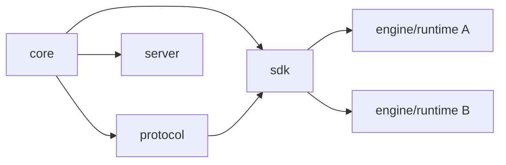

# Dependency Graph

## Index

- [Target Direction](#target-direction)
- [Rules](#rules)

## Target Direction

## Rules

- The core is the most stable layer.
- Protocol and SDK layers adapt, but do not redefine the core.
- Engines depend on SDKs, not on the core directly.
- Server-side components remain optional and separate.
