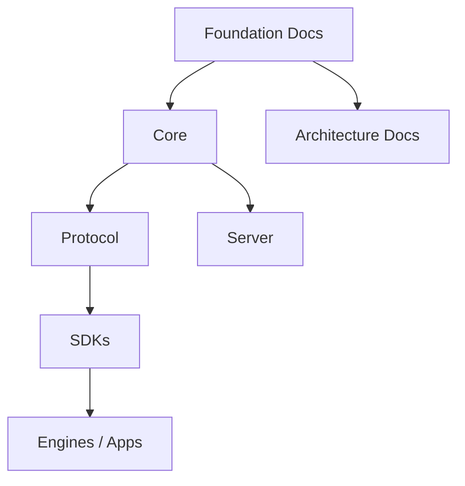

# Architecture Overview

## Index

- [System View](#system-view)
- [Layer Responsibilities](#layer-responsibilities)
- [Design Rules](#design-rules)

## System View

Resonance follows a layered architecture designed to isolate the core domain from runtime integrations.

## Layer Responsibilities

- Foundation documents define intent and limits.
- Architecture documents define boundaries and dependency direction.
- Core defines the engine-agnostic model.
- SDKs translate that model to specific runtimes.
- Server-side components remain optional and isolated.

## Design Rules

- No engine dependency in the core.
- No hidden coupling across modules.
- No implementation detail in conceptual documents unless it is necessary to explain the boundary.
