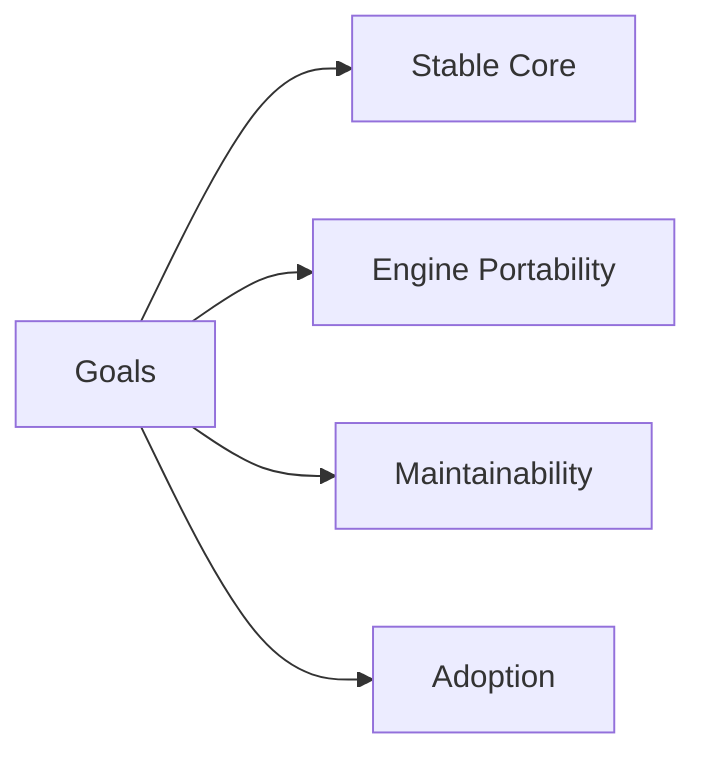

# Goals

## Index

- [Summary](#summary)
- [Objective](#objective)
- [Scope](#scope)
- [Diagram](#diagram)
- [Responsibilities](#responsibilities)
- [Non-Responsibilities](#non-responsibilities)
- [Notes](#notes)
- [References](#references)
- [Acceptance Criteria](#acceptance-criteria)

## Summary

Resonance should provide a stable conceptual and technical base for spatial interaction systems.

## Objective

Identify the outcomes the project must achieve to be considered successful.

## Scope

This document lists product-level goals, not feature-level commitments.

## Diagram

## Responsibilities

- Preserve engine neutrality.
- Support long-term maintainability.
- Keep documentation and architecture first-class.
- Make future SDK adoption straightforward.

## Non-Responsibilities

- Promise feature completeness too early.
- Optimize for one engine at the expense of the ecosystem.
- Encode implementation specifics as goals.

## Notes

Goals should remain high-level and durable.

## References

- [vision.md](vision.md)
- [requirements.md](requirements.md)
- [success-metrics.md](success-metrics.md)

## Acceptance Criteria

- Each goal is understandable without implementation detail.
- Each goal aligns with the project architecture.
- No goal conflicts with the non-goals document.
