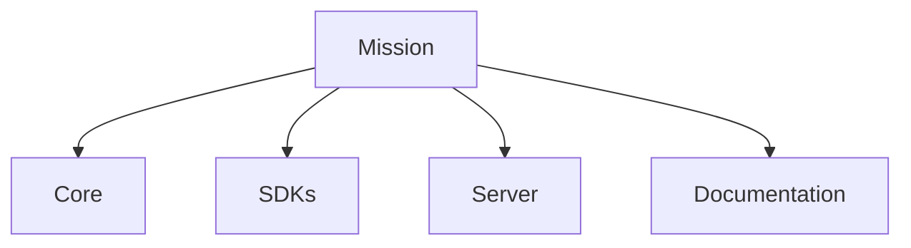

# Mission

## Index

- [Summary](#summary)
- [Objective](#objective)
- [Scope](#scope)
- [Diagram](#diagram)
- [Responsibilities](#responsibilities)
- [Non-Responsibilities](#non-responsibilities)
- [Notes](#notes)
- [References](#references)
- [Acceptance Criteria](#acceptance-criteria)

## Summary

Build a modular, engine-agnostic foundation for spatial interaction that can be adopted across many runtimes.

## Objective

Turn the vision into a durable technical mission that guides implementation sequencing and design review.

## Scope

The mission describes what Resonance will do as a project, not what a specific runtime layer will do.

## Diagram

## Responsibilities

- Define the project purpose.
- Keep the scope focused on spatial interaction.
- Establish a reusable technical foundation.

## Non-Responsibilities

- Describe product marketing positioning.
- Define feature implementation order in detail.
- Expand the scope beyond spatial interaction.

## Notes

The mission should be actionable enough to guide architecture, but not so narrow that it blocks future growth.

## References

- [vision.md](vision.md)
- [goals.md](goals.md)
- [non-goals.md](non-goals.md)

## Acceptance Criteria

- The mission is short, direct, and measurable.
- The mission is consistent with the repository architecture.
- The mission supports multi-engine adoption.
