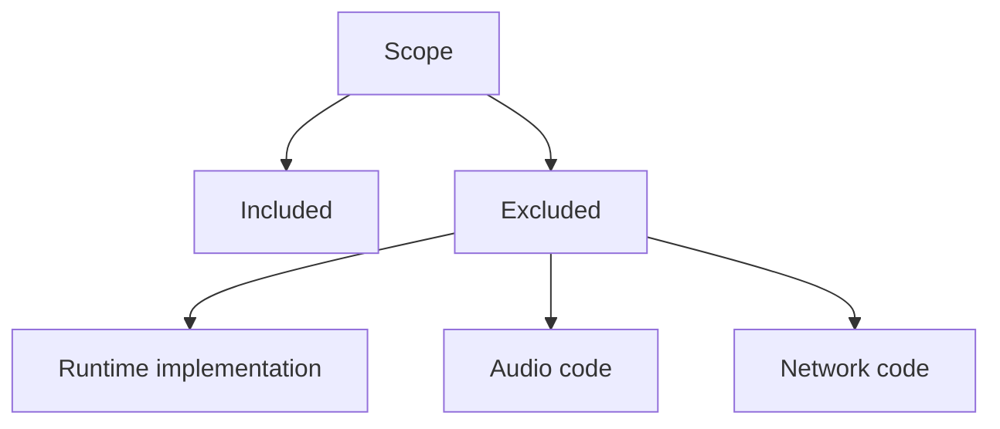

# Non-Goals

## Index

- [Summary](#summary)
- [Objective](#objective)
- [Scope](#scope)
- [Diagram](#diagram)
- [Responsibilities](#responsibilities)
- [Non-Responsibilities](#non-responsibilities)
- [Notes](#notes)
- [References](#references)
- [Acceptance Criteria](#acceptance-criteria)

## Summary

The foundation phase does not include implementation of runtime features.

## Objective

Prevent scope creep and protect the project from premature design decisions.

## Scope

This document defines what Resonance will not attempt during the foundation and specification phases.

## Diagram

## Responsibilities

- State the boundaries of the current phase.
- Keep the project focused on specification work.
- Prevent accidental implementation drift.

## Non-Responsibilities

- Implement audio, networking, protocol bytes, or server runtime code.
- Define low-level algorithms before the contract exists.
- Expand scope to unrelated product areas.

## Notes

Non-goals are as important as goals for a long-lived open source foundation.

## References

- [goals.md](goals.md)
- [requirements.md](requirements.md)
- [../02-architecture/design-principles.md](../02-architecture/design-principles.md)

## Acceptance Criteria

- The excluded items are explicit.
- The document prevents scope confusion.
- The document does not leave room for hidden assumptions.
