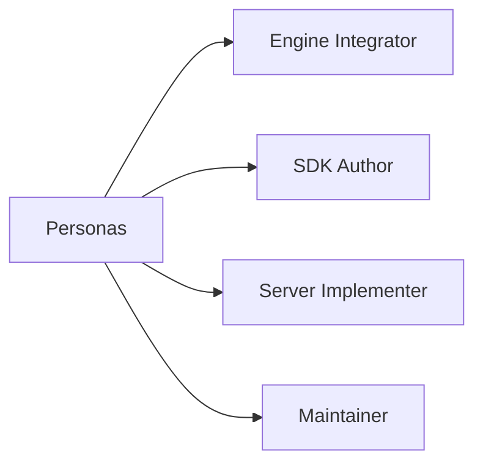

# Personas

## Index

- [Summary](#summary)
- [Objective](#objective)
- [Scope](#scope)
- [Diagram](#diagram)
- [Responsibilities](#responsibilities)
- [Non-Responsibilities](#non-responsibilities)
- [Notes](#notes)
- [References](#references)
- [Acceptance Criteria](#acceptance-criteria)

## Summary

Resonance should serve engine integrators, SDK authors, server implementers, and technical maintainers.

## Objective

Describe the main groups that will consume the specification and shape implementation decisions.

## Scope

Personas are technical roles, not marketing archetypes.

## Diagram

## Responsibilities

- Identify who the specification is written for.
- Clarify which roles need stable contracts.
- Support documentation and API design.

## Non-Responsibilities

- Replace requirements or architecture decisions.
- Describe end users in product-marketing language.
- Add implementation-specific behavior.

## Notes

Personas should be kept minimal and only used where they improve clarity.

## References

- [use-cases.md](use-cases.md)
- [requirements.md](requirements.md)
- [../../sdk/README.md](../../sdk/README.md)

## Acceptance Criteria

- The technical audience is clearly identified.
- The personas help explain document priorities.
- The personas do not add unnecessary complexity.
