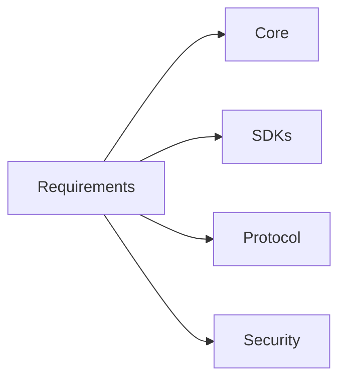

# Requirements

## Index

- [Summary](#summary)
- [Objective](#objective)
- [Scope](#scope)
- [Diagram](#diagram)
- [Responsibilities](#responsibilities)
- [Non-Responsibilities](#non-responsibilities)
- [Notes](#notes)
- [References](#references)
- [Acceptance Criteria](#acceptance-criteria)

## Summary

Requirements define the minimum technical expectations that every future implementation must satisfy.

## Objective

Translate product intent into enforceable expectations without jumping into code.

## Scope

This document captures architectural and behavioral requirements, not implementation tasks.

## Diagram

## Responsibilities

- Define mandatory technical expectations.
- Keep implementation aligned with project goals.
- Create a basis for acceptance and review.

## Non-Responsibilities

- Specify low-level algorithms.
- Choose transport encoding or audio engine details.
- Replace detailed component specifications.

## Notes

Requirements should be testable or at least verifiable by design review.

## References

- [goals.md](goals.md)
- [success-metrics.md](success-metrics.md)
- [../02-architecture/system-overview.md](../02-architecture/system-overview.md)

## Acceptance Criteria

- Requirements are clear and measurable.
- Requirements are compatible with the architecture documents.
- Requirements do not force implementation details too early.
