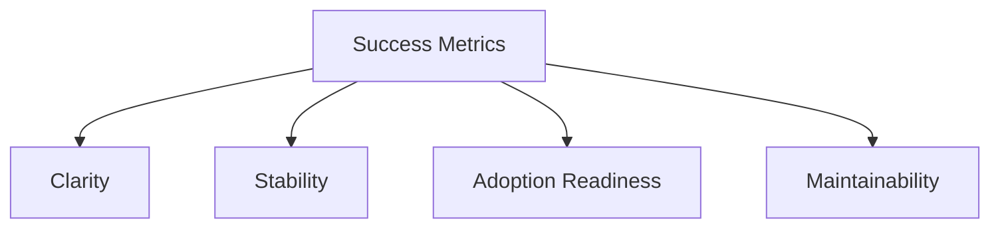

# Success Metrics

## Index

- [Summary](#summary)
- [Objective](#objective)
- [Scope](#scope)
- [Diagram](#diagram)
- [Responsibilities](#responsibilities)
- [Non-Responsibilities](#non-responsibilities)
- [Notes](#notes)
- [References](#references)
- [Acceptance Criteria](#acceptance-criteria)

## Summary

Success should be measured by clarity, adoption readiness, stability, and maintainability.

## Objective

Define the signals that indicate the foundation is ready for implementation and future growth.

## Scope

This document describes technical success metrics, not product marketing KPIs.

## Diagram

## Responsibilities

- Define what good looks like for the project foundation.
- Help maintainers judge readiness for next phases.
- Support roadmap prioritization.

## Non-Responsibilities

- Replace engineering judgment.
- Set arbitrary goals without purpose.
- Measure implementation that does not yet exist.

## Notes

Metrics should remain practical and linked to actual project outcomes.

## References

- [goals.md](goals.md)
- [requirements.md](requirements.md)
- [../../README.md](../../README.md)

## Acceptance Criteria

- Metrics are understandable and actionable.
- Metrics align with the current foundation phase.
- Metrics do not depend on unimplemented code.
