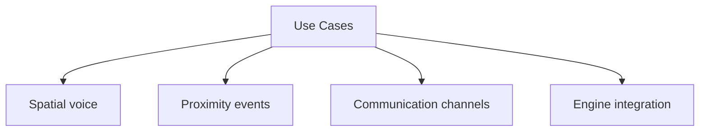

# Use Cases

## Index

- [Summary](#summary)
- [Objective](#objective)
- [Scope](#scope)
- [Diagram](#diagram)
- [Responsibilities](#responsibilities)
- [Non-Responsibilities](#non-responsibilities)
- [Notes](#notes)
- [References](#references)
- [Acceptance Criteria](#acceptance-criteria)

## Summary

Resonance should support spatial communication, proximity interaction, and multi-engine integration scenarios.

## Objective

Provide a stable set of use cases that justify the architecture and protocol boundaries.

## Scope

Use cases are limited to spatial interaction in multiplayer and simulation contexts.

## Diagram

## Responsibilities

- Illustrate the project’s expected value.
- Anchor architecture decisions in practical needs.
- Show why engine neutrality matters.

## Non-Responsibilities

- Define API signatures.
- Define packet formats.
- Enumerate every future feature.

## Notes

Use cases should be realistic, stable, and easy to trace back to the product goals.

## References

- [vision.md](vision.md)
- [requirements.md](requirements.md)
- [../../README.md](../../README.md)

## Acceptance Criteria

- Each use case is understandable without implementation.
- The set covers core and integration needs.
- The set does not imply unsupported scope.
