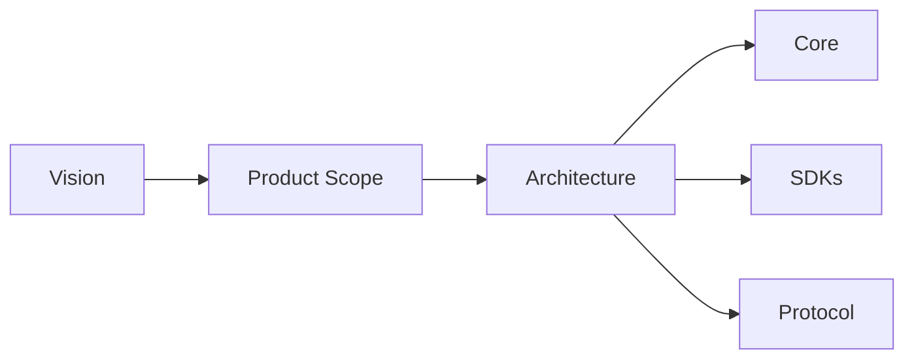

# Vision

## Index

- [Summary](#summary)
- [Objective](#objective)
- [Scope](#scope)
- [Diagram](#diagram)
- [Responsibilities](#responsibilities)
- [Non-Responsibilities](#non-responsibilities)
- [Notes](#notes)
- [References](#references)
- [Acceptance Criteria](#acceptance-criteria)

## Summary

Resonance exists to become the shared engine-agnostic foundation for spatial interaction in multiplayer and simulation software.

## Objective

Define a long-lived technical vision that can guide architecture, protocol, SDK, and server decisions for years.

## Scope

The vision covers the entire product, but it does not define implementation detail.

## Diagram

## Responsibilities

- Define the desired future state of Resonance.
- Keep the project aligned around engine neutrality.
- Guide the formation of stable contracts.

## Non-Responsibilities

- Define implementation details.
- Choose concrete algorithms.
- Commit the project to one engine or one deployment style.

## Notes

The vision should remain stable unless the project itself changes direction.

## References

- [mission.md](mission.md)
- [goals.md](goals.md)
- [requirements.md](requirements.md)
- [../../README.md](../../README.md)

## Acceptance Criteria

- The vision is concise, clear, and durable.
- The vision is compatible with every major engine integration.
- The vision does not force premature implementation decisions.
