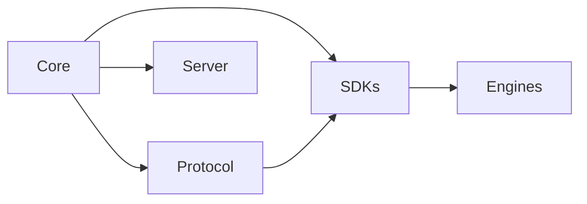

# Dependencies

## Index

- [Summary](#summary)
- [Objective](#objective)
- [Scope](#scope)
- [Diagram](#diagram)
- [Responsibilities](#responsibilities)
- [Non-Responsibilities](#non-responsibilities)
- [Notes](#notes)
- [References](#references)
- [Acceptance Criteria](#acceptance-criteria)

## Summary

Dependencies must flow from stable core concepts to more volatile adapters, never the reverse.

## Objective

Define the allowed dependency direction for the entire repository.

## Scope

This document covers architectural dependency rules, not package manager configuration.

## Diagram

## Responsibilities

- Keep the core independent.
- Allow adapters to depend on the core.
- Prevent reverse dependencies that would destabilize the architecture.

## Non-Responsibilities

- Specify build tooling.
- Define runtime transport layers.
- Introduce direct dependencies from engines into the core.

## Notes

If a dependency is convenient but breaks the direction model, it is not allowed.

## References

- [system-overview.md](system-overview.md)
- [design-principles.md](design-principles.md)
- [../03-core/module-boundaries.md](../03-core/module-boundaries.md)

## Acceptance Criteria

- The dependency graph is clear.
- The core has no engine dependency.
- Adapter layers do not rewrite core responsibility.
