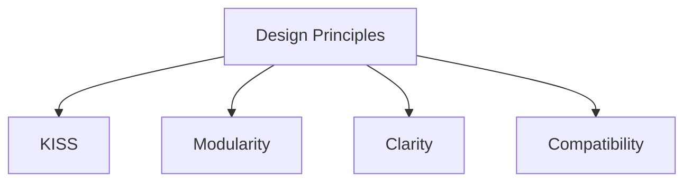

# Design Principles

## Index

- [Summary](#summary)
- [Objective](#objective)
- [Scope](#scope)
- [Diagram](#diagram)
- [Responsibilities](#responsibilities)
- [Non-Responsibilities](#non-responsibilities)
- [Notes](#notes)
- [References](#references)
- [Acceptance Criteria](#acceptance-criteria)

## Summary

Resonance design should stay simple, modular, explicit, and durable.

## Objective

Capture the principles that all architecture and specification work must follow.

## Scope

This document defines design behavior across the repository.

## Diagram

## Responsibilities

- Keep the system understandable.
- Prevent over-engineering.
- Favor explicit contracts and narrow boundaries.

## Non-Responsibilities

- Optimize prematurely.
- Add generic abstractions without real benefit.
- Substitute principles for concrete requirements.

## Notes

Design principles are the filter used when two technically valid choices exist.

## References

- [system-overview.md](system-overview.md)
- [dependencies.md](dependencies.md)
- [../../ARCHITECTURE.md](../../ARCHITECTURE.md)

## Acceptance Criteria

- The principles are easy to remember.
- The principles support future compatibility.
- The principles remain stable over time.
