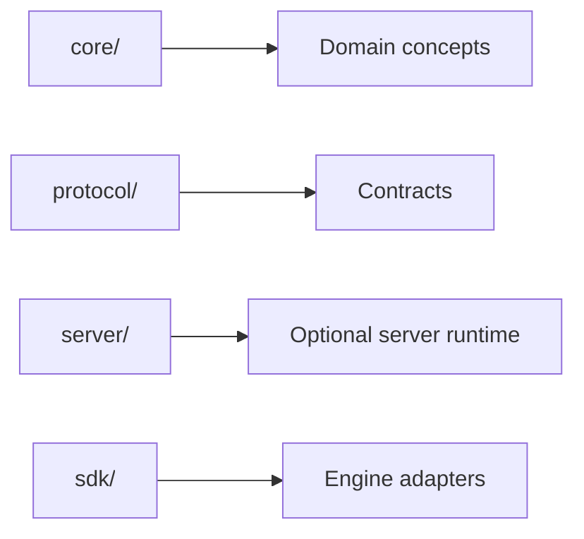

# Module Responsibilities

## Index

- [Summary](#summary)
- [Objective](#objective)
- [Scope](#scope)
- [Diagram](#diagram)
- [Responsibilities](#responsibilities)
- [Non-Responsibilities](#non-responsibilities)
- [Notes](#notes)
- [References](#references)
- [Acceptance Criteria](#acceptance-criteria)

## Summary

Each top-level module in Resonance has a defined purpose and a limited ownership area.

## Objective

Assign responsibilities so implementation work does not blur architectural boundaries.

## Scope

This document covers the major repository areas and their intended ownership.

## Diagram

## Responsibilities

- Define the purpose of each top-level area.
- Keep ownership clear and explicit.
- Prevent overlapping responsibility between layers.

## Non-Responsibilities

- Specify file-by-file implementation details.
- Move decisions away from ADRs and product docs.
- Treat modules as interchangeable if their responsibilities differ.

## Notes

Module responsibility is a structural decision, not an implementation convenience.

## References

- [system-overview.md](system-overview.md)
- [dependencies.md](dependencies.md)
- [../03-core/module-boundaries.md](../03-core/module-boundaries.md)

## Acceptance Criteria

- Each major directory has a clearly described role.
- No two modules claim the same primary responsibility.
- Dependency direction matches the architecture.
