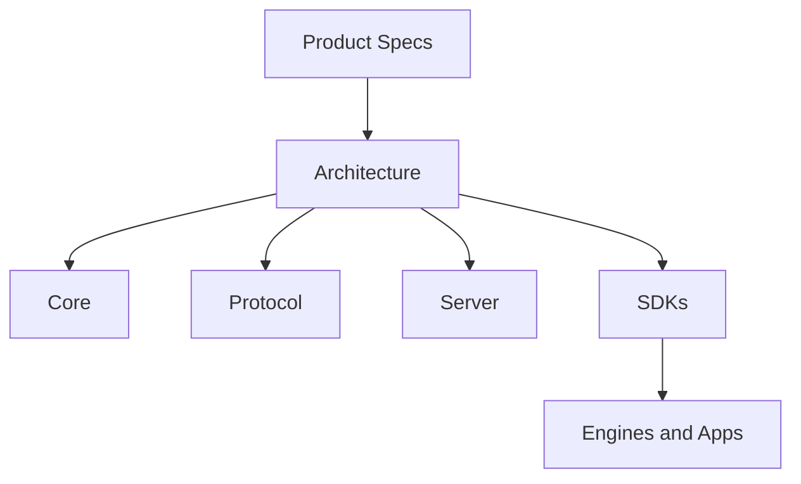

# System Overview

## Index

- [Summary](#summary)
- [Objective](#objective)
- [Scope](#scope)
- [Diagram](#diagram)
- [Responsibilities](#responsibilities)
- [Non-Responsibilities](#non-responsibilities)
- [Notes](#notes)
- [References](#references)
- [Acceptance Criteria](#acceptance-criteria)

## Summary

Resonance is organized as a layered, engine-agnostic system with explicit boundaries between product intent, core concepts, protocol, server, and SDKs.

## Objective

Describe the high-level structure that all future documents and implementations must respect.

## Scope

This document covers the complete system view, not individual module behavior.

## Diagram

## Responsibilities

- Describe the system as a whole.
- Clarify layer ordering and dependency flow.
- Keep the architecture engine-agnostic.

## Non-Responsibilities

- Define implementation algorithms.
- Duplicate specialized behavior from lower-level documents.
- Introduce runtime-specific concerns into the core view.

## Notes

The system overview is the first architecture document to consult after product intent.

## References

- [module-responsibilities.md](module-responsibilities.md)
- [dependencies.md](dependencies.md)
- [design-principles.md](design-principles.md)

## Acceptance Criteria

- The major layers are visible and distinct.
- The dependency direction is unambiguous.
- The document does not imply implementation detail.
