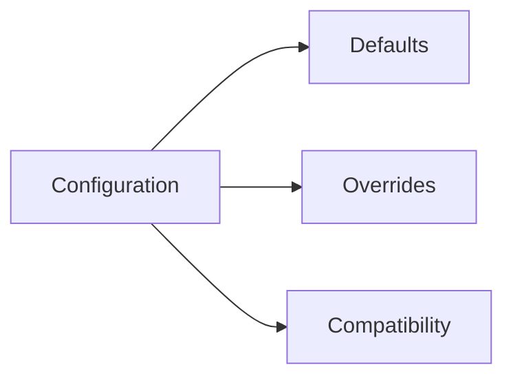

# Configuration

## Index

- [Summary](#summary)
- [Objective](#objective)
- [Scope](#scope)
- [Diagram](#diagram)
- [Responsibilities](#responsibilities)
- [Non-Responsibilities](#non-responsibilities)
- [Notes](#notes)
- [References](#references)
- [Acceptance Criteria](#acceptance-criteria)

## Summary

Core configuration should be minimal, stable, and easy to extend without breaking integrations.

## Objective

Define configuration behavior without prescribing a specific file format or runtime API.

## Scope

This document covers configuration intent, defaults, and compatibility rules.

## Diagram

## Responsibilities

- State the role of configuration in the core.
- Keep defaults predictable.
- Support future adapters and tools.

## Non-Responsibilities

- Choose configuration file formats.
- Define UI tooling.
- Turn configuration into a sprawling options system.

## Notes

Configuration should stay simpler than the systems it configures.

## References

- [core-overview.md](core-overview.md)
- [error-handling.md](error-handling.md)
- [../14-build/build-matrix.md](../14-build/build-matrix.md)

## Acceptance Criteria

- Configuration behavior is stable and minimal.
- Defaults are clearly described.
- The document does not encourage overconfiguration.
