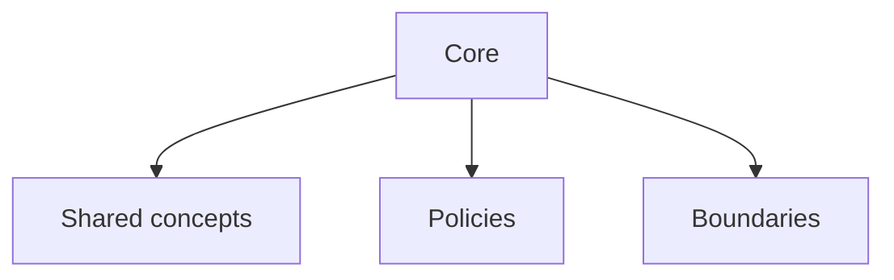

# Core Overview

## Index

- [Summary](#summary)
- [Objective](#objective)
- [Scope](#scope)
- [Diagram](#diagram)
- [Responsibilities](#responsibilities)
- [Non-Responsibilities](#non-responsibilities)
- [Notes](#notes)
- [References](#references)
- [Acceptance Criteria](#acceptance-criteria)

## Summary

The core is the stable, engine-agnostic center of Resonance.

## Objective

Define the role of the core and the rules that protect it from engine and deployment concerns.

## Scope

This document applies to all core modules and shared behaviors.

## Diagram

## Responsibilities

- Define the engine-neutral center of the system.
- Hold shared concepts and rules.
- Remain stable across SDKs and deployments.

## Non-Responsibilities

- Host engine APIs.
- Define transport specifics.
- Embed server behavior.

## Notes

The core should be as small as possible while still capturing the domain.

## References

- [module-boundaries.md](module-boundaries.md)
- [configuration.md](configuration.md)
- [../02-architecture/dependencies.md](../02-architecture/dependencies.md)

## Acceptance Criteria

- The core is independent from engine-specific dependencies.
- The core is understandable without a specific runtime.
- The document matches the architecture boundary rules.
