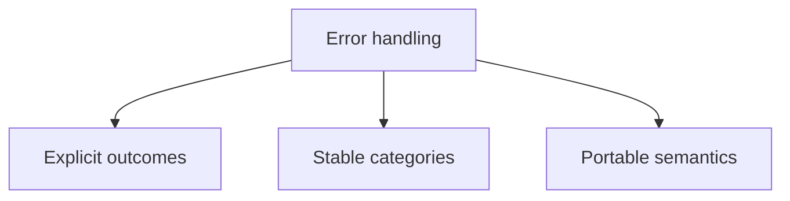

# Error Handling

## Index

- [Summary](#summary)
- [Objective](#objective)
- [Scope](#scope)
- [Diagram](#diagram)
- [Responsibilities](#responsibilities)
- [Non-Responsibilities](#non-responsibilities)
- [Notes](#notes)
- [References](#references)
- [Acceptance Criteria](#acceptance-criteria)

## Summary

Error handling in the core must be explicit, stable, and suitable for multiple languages.

## Objective

Describe how core failures should be represented and reasoned about.

## Scope

This document covers error semantics, not exception implementation details.

## Diagram

## Responsibilities

- Define predictable failure behavior.
- Support interoperability across SDKs.
- Avoid hidden or ambiguous error states.

## Non-Responsibilities

- Mandate one exception system.
- Encode implementation stack traces as API surface.
- Turn every failure into a unique type.

## Notes

Error handling should be simple enough to port cleanly across language boundaries.

## References

- [core-overview.md](core-overview.md)
- [memory.md](memory.md)
- [../09-api/api-philosophy.md](../09-api/api-philosophy.md)

## Acceptance Criteria

- Failure states are understandable.
- Error categories remain stable.
- SDKs can map errors without losing meaning.
