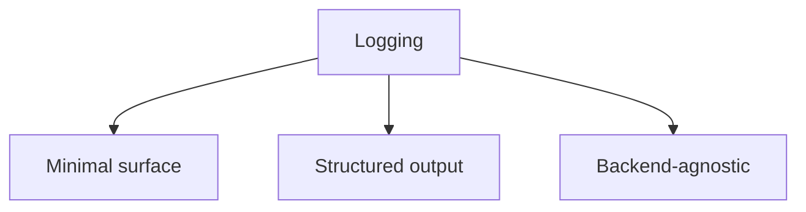

# Logging

## Index

- [Summary](#summary)
- [Objective](#objective)
- [Scope](#scope)
- [Diagram](#diagram)
- [Responsibilities](#responsibilities)
- [Non-Responsibilities](#non-responsibilities)
- [Notes](#notes)
- [References](#references)
- [Acceptance Criteria](#acceptance-criteria)

## Summary

Logging in the core must remain minimal, structured, and non-invasive.

## Objective

Define how core diagnostics should behave without binding to a logging backend.

## Scope

This document covers logging intent, not logging implementation.

## Diagram

## Responsibilities

- Keep diagnostics useful.
- Avoid coupling core behavior to a specific logger.
- Allow adapters to provide their own logging sinks.

## Non-Responsibilities

- Define logging frameworks.
- Produce verbose runtime chatter by default.
- Hard-code output destinations.

## Notes

Logs should help debugging without becoming a dependency magnet.

## References

- [core-overview.md](core-overview.md)
- [error-handling.md](error-handling.md)
- [../12-security/security-model.md](../12-security/security-model.md)

## Acceptance Criteria

- Logging remains optional and bounded.
- Log output is structured enough for tooling.
- Core does not depend on a concrete logger.
