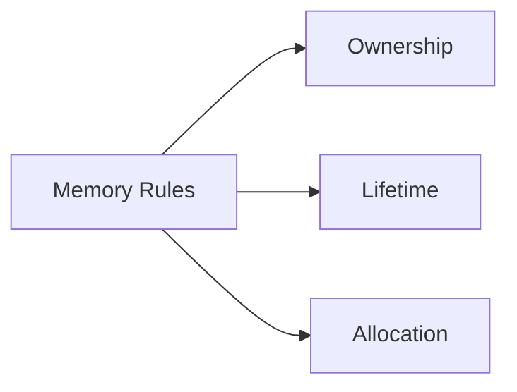

# Memory

## Index

- [Summary](#summary)
- [Objective](#objective)
- [Scope](#scope)
- [Diagram](#diagram)
- [Responsibilities](#responsibilities)
- [Non-Responsibilities](#non-responsibilities)
- [Notes](#notes)
- [References](#references)
- [Acceptance Criteria](#acceptance-criteria)

## Summary

The core must follow clear memory ownership rules to remain portable and safe across runtimes.

## Objective

Define memory expectations without choosing a specific programming model.

## Scope

This document covers ownership, lifetimes, and allocation expectations at the specification level.

## Diagram

## Responsibilities

- State memory ownership expectations.
- Keep ownership explicit.
- Support language and engine bindings.

## Non-Responsibilities

- Choose allocator implementations.
- Define low-level optimization tricks.
- Hide ownership behind ambiguous conventions.

## Notes

Memory rules should make cross-language binding safer, not harder.

## References

- [core-overview.md](core-overview.md)
- [error-handling.md](error-handling.md)
- [../09-api/api-philosophy.md](../09-api/api-philosophy.md)

## Acceptance Criteria

- Ownership is explicit.
- Lifetime behavior is clear.
- The rules are compatible with SDK adapters.
