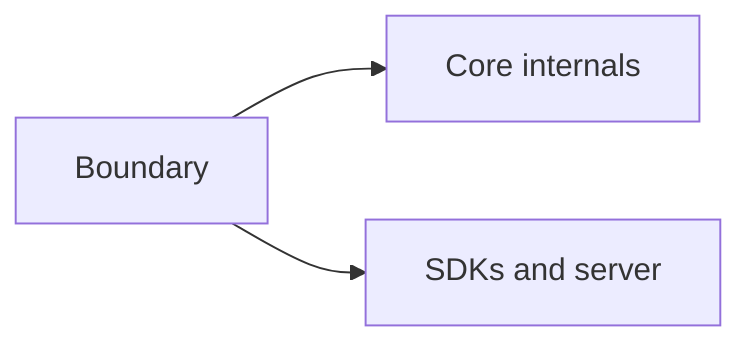

# Module Boundaries

## Index

- [Summary](#summary)
- [Objective](#objective)
- [Scope](#scope)
- [Diagram](#diagram)
- [Responsibilities](#responsibilities)
- [Non-Responsibilities](#non-responsibilities)
- [Notes](#notes)
- [References](#references)
- [Acceptance Criteria](#acceptance-criteria)

## Summary

Core module boundaries must stay narrow so the engine-agnostic center remains easy to maintain.

## Objective

Define the internal separation rules for the core layer.

## Scope

This document applies to boundaries inside the core and between core and non-core layers.

## Diagram

## Responsibilities

- Keep core internals isolated.
- Protect the public core surface.
- Make dependency direction obvious.

## Non-Responsibilities

- Describe non-core module internals.
- Create unnecessary internal layers.
- Allow outward layers to redefine core behavior.

## Notes

Boundaries should exist only where they reduce confusion or coupling.

## References

- [core-overview.md](core-overview.md)
- [../02-architecture/dependencies.md](../02-architecture/dependencies.md)

## Acceptance Criteria

- Core boundaries are easy to explain.
- Internal modules remain coherent.
- External layers do not leak into the core.
