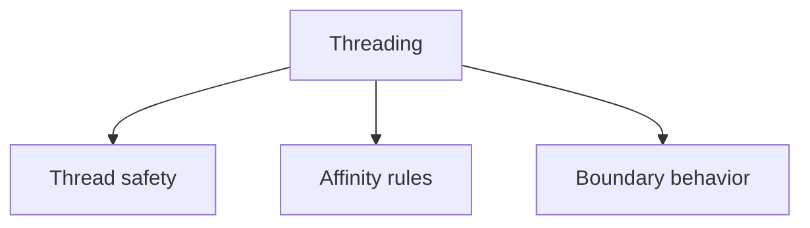

# Threading

## Index

- [Summary](#summary)
- [Objective](#objective)
- [Scope](#scope)
- [Diagram](#diagram)
- [Responsibilities](#responsibilities)
- [Non-Responsibilities](#non-responsibilities)
- [Notes](#notes)
- [References](#references)
- [Acceptance Criteria](#acceptance-criteria)

## Summary

Threading rules must be explicit so integrations can remain predictable across engines and platforms.

## Objective

Describe the concurrency expectations for the core at the specification level.

## Scope

This document covers threading semantics, not scheduling implementations.

## Diagram

## Responsibilities

- Define thread-safety expectations.
- Identify where concurrent access is allowed.
- Make engine integration easier to reason about.

## Non-Responsibilities

- Choose task schedulers.
- Specify lock implementations.
- Expose thread management APIs too early.

## Notes

Threading should be conservative until there is a concrete need for more sophistication.

## References

- [core-overview.md](core-overview.md)
- [../09-api/api-philosophy.md](../09-api/api-philosophy.md)
- [../13-testing/testing-strategy.md](../13-testing/testing-strategy.md)

## Acceptance Criteria

- Threading assumptions are explicit.
- The document avoids ambiguity around concurrent use.
- The rules are practical for SDK authors.
