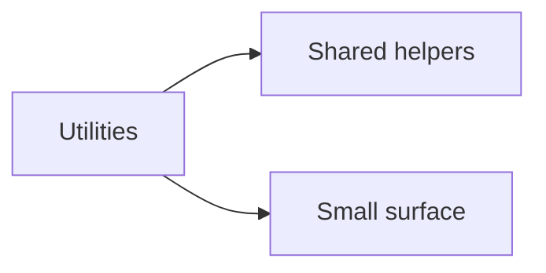

# Utilities

## Index

- [Summary](#summary)
- [Objective](#objective)
- [Scope](#scope)
- [Diagram](#diagram)
- [Responsibilities](#responsibilities)
- [Non-Responsibilities](#non-responsibilities)
- [Notes](#notes)
- [References](#references)
- [Acceptance Criteria](#acceptance-criteria)

## Summary

Core utilities must be small, reusable, and clearly owned.

## Objective

Specify the role of helper utilities without turning the core into a utility dump.

## Scope

This document covers shared helper behavior that may be reused across core modules.

## Diagram

## Responsibilities

- Provide narrow helper behavior when it reduces duplication.
- Keep shared helpers easy to audit.
- Avoid hidden dependence on runtime features.

## Non-Responsibilities

- Become a general-purpose toolbox.
- Hold feature logic.
- Introduce convenience at the cost of clarity.

## Notes

If a utility is not broadly reusable, it should live closer to its callers.

## References

- [core-overview.md](core-overview.md)
- [module-boundaries.md](module-boundaries.md)

## Acceptance Criteria

- Utilities are explicitly limited.
- Helper scope remains easy to understand.
- Utilities do not grow into an unbounded shared layer.
