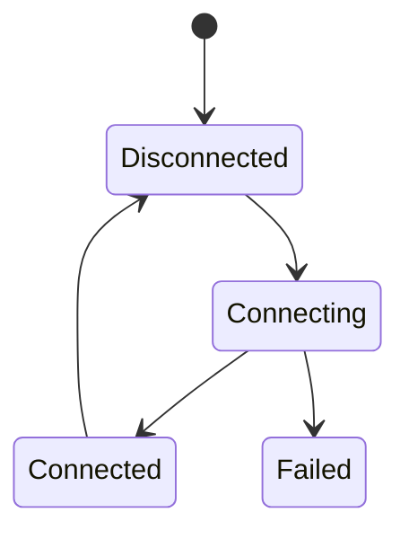

# Connection

## Index

- [Summary](#summary)
- [Objective](#objective)
- [Scope](#scope)
- [Diagram](#diagram)
- [Responsibilities](#responsibilities)
- [Non-Responsibilities](#non-responsibilities)
- [Notes](#notes)
- [References](#references)
- [Acceptance Criteria](#acceptance-criteria)

## Summary

A connection represents the transport relationship between two Resonance endpoints.

## Objective

Define the expected lifecycle and behavioral guarantees of a connection without choosing a transport protocol.

## Scope

This document covers connection state and observable behavior only.

## Diagram

## Responsibilities

- Establish a usable path between endpoints.
- Report connection state transitions clearly.
- Support reconnect and session continuity expectations.

## Non-Responsibilities

- Define packet formats.
- Choose a transport implementation.
- Hide state transitions from observers.

## Notes

Connection behavior should be understandable even when the transport changes.

## References

- [session.md](session.md)
- [reconnect.md](reconnect.md)
- [../10-protocol/protocol-overview.md](../10-protocol/protocol-overview.md)

## Acceptance Criteria

- Connection states are explicit.
- The lifecycle is deterministic enough for SDKs.
- No transport-specific rule leaks into the definition.
