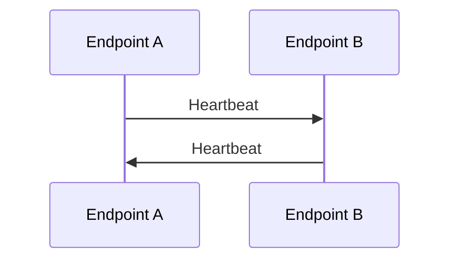

# Heartbeat

## Index

- [Summary](#summary)
- [Objective](#objective)
- [Scope](#scope)
- [Diagram](#diagram)
- [Responsibilities](#responsibilities)
- [Non-Responsibilities](#non-responsibilities)
- [Notes](#notes)
- [References](#references)
- [Acceptance Criteria](#acceptance-criteria)

## Summary

A heartbeat is the periodic signal used to confirm liveness and timing expectations.

## Objective

Define heartbeat behavior as an observable contract.

## Scope

This document covers heartbeat semantics, not timing packet design.

## Diagram

## Responsibilities

- Indicate liveness.
- Support timeout and latency expectations.
- Help detect degraded connectivity.

## Non-Responsibilities

- Replace connection state.
- Define wire format.
- Guarantee performance by itself.

## Notes

Heartbeat frequency should be treated as a policy, not a hardcoded transport rule.

## References

- [connection.md](connection.md)
- [latency.md](latency.md)
- [jitter.md](jitter.md)

## Acceptance Criteria

- Liveness behavior is explicit.
- Time-based expectations are documented.
- Heartbeats do not redefine the session model.
