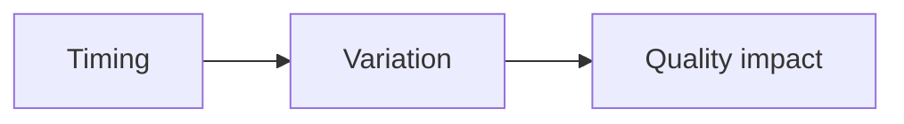

# Jitter

## Index

- [Summary](#summary)
- [Objective](#objective)
- [Scope](#scope)
- [Diagram](#diagram)
- [Responsibilities](#responsibilities)
- [Non-Responsibilities](#non-responsibilities)
- [Notes](#notes)
- [References](#references)
- [Acceptance Criteria](#acceptance-criteria)

## Summary

Jitter is the variation in timing that affects consistency and perceived quality.

## Objective

Specify jitter as a quality factor that future implementations must handle.

## Scope

This document covers timing variance and smoothing expectations.

## Diagram

## Responsibilities

- Recognize timing instability.
- Guide buffering and smoothing policy.
- Support resilience under unstable conditions.

## Non-Responsibilities

- Define buffer algorithms.
- Eliminate jitter entirely.
- Replace latency budgets.

## Notes

Jitter handling should be conservative and easy to reason about.

## References

- [latency.md](latency.md)
- [packet-loss.md](packet-loss.md)
- [../05-audio/buffers.md](../05-audio/buffers.md)

## Acceptance Criteria

- Jitter is defined as a first-class quality concern.
- The document avoids algorithm detail.
- The impact on quality is clear.
