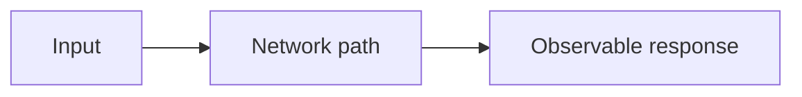

# Latency

## Index

- [Summary](#summary)
- [Objective](#objective)
- [Scope](#scope)
- [Diagram](#diagram)
- [Responsibilities](#responsibilities)
- [Non-Responsibilities](#non-responsibilities)
- [Notes](#notes)
- [References](#references)
- [Acceptance Criteria](#acceptance-criteria)

## Summary

Latency is the time cost that affects responsiveness across the system.

## Objective

Define latency as a measurable contract concern.

## Scope

This document covers latency expectations and budgeting.

## Diagram

## Responsibilities

- Set response-time expectations.
- Inform performance and protocol design.
- Support user-facing quality goals.

## Non-Responsibilities

- Promise impossible real-time behavior.
- Replace performance budgeting.
- Define transport tuning.

## Notes

Latency targets should be realistic across platforms and network conditions.

## References

- [jitter.md](jitter.md)
- [packet-loss.md](packet-loss.md)
- [../11-performance/targets.md](../11-performance/targets.md)

## Acceptance Criteria

- Latency is measurable.
- Expectations are documented.
- The document stays architecture-friendly.
