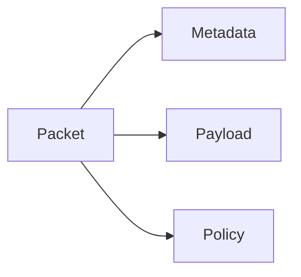

# Packet

## Index

- [Summary](#summary)
- [Objective](#objective)
- [Scope](#scope)
- [Diagram](#diagram)
- [Responsibilities](#responsibilities)
- [Non-Responsibilities](#non-responsibilities)
- [Notes](#notes)
- [References](#references)
- [Acceptance Criteria](#acceptance-criteria)

## Summary

A packet is the unit of exchange used to move data across a transport.

## Objective

Describe packet behavior at the contract level without specifying bytes or framing details.

## Scope

This document covers packet semantics only.

## Diagram

## Responsibilities

- Provide a clear exchange unit.
- Support validation and routing expectations.
- Carry metadata needed for protocol behavior.

## Non-Responsibilities

- Define serialization format.
- Define compression internals.
- Replace higher-level message semantics.

## Notes

Packets are transport-facing, while messages are protocol-facing.

## References

- [serialization.md](serialization.md)
- [compression.md](compression.md)
- [../10-protocol/messages.md](../10-protocol/messages.md)

## Acceptance Criteria

- The packet unit is well-defined.
- The packet does not expose byte-level implementation.
- The document stays transport-agnostic.
