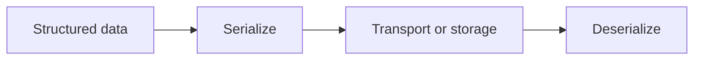

# Serialization

## Index

- [Summary](#summary)
- [Objective](#objective)
- [Scope](#scope)
- [Diagram](#diagram)
- [Responsibilities](#responsibilities)
- [Non-Responsibilities](#non-responsibilities)
- [Notes](#notes)
- [References](#references)
- [Acceptance Criteria](#acceptance-criteria)

## Summary

Serialization defines how structured information is transformed for transport or persistence.

## Objective

Specify serialization expectations without selecting a concrete format.

## Scope

This document covers serialization behavior at the specification level.

## Diagram

## Responsibilities

- Preserve meaning across boundaries.
- Remain compatible with versioning rules.
- Support future adapters and protocol evolution.

## Non-Responsibilities

- Choose a format.
- Optimize for a particular engine.
- Hide compatibility tradeoffs.

## Notes

Serialization should be deterministic enough for validation and interoperability.

## References

- [packet.md](packet.md)
- [../10-protocol/versioning.md](../10-protocol/versioning.md)
- [../11-performance/targets.md](../11-performance/targets.md)

## Acceptance Criteria

- Structured data can be serialized and recovered consistently.
- Compatibility rules are documented.
- The serialization model remains implementation-neutral.
