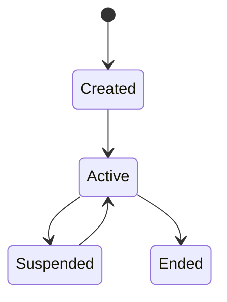

# Session

## Index

- [Summary](#summary)
- [Objective](#objective)
- [Scope](#scope)
- [Diagram](#diagram)
- [Responsibilities](#responsibilities)
- [Non-Responsibilities](#non-responsibilities)
- [Notes](#notes)
- [References](#references)
- [Acceptance Criteria](#acceptance-criteria)

## Summary

A session represents the logical participation of a client or player within Resonance.

## Objective

Define session behavior independently from transport connectivity.

## Scope

This document covers logical participation, not transport internals.

## Diagram

## Responsibilities

- Track logical presence in the system.
- Survive transient connection changes where possible.
- Provide a stable anchor for related state.

## Non-Responsibilities

- Represent transport endpoints directly.
- Manage audio pipelines.
- Encode server-specific deployment logic.

## Notes

Session and connection are related, but not the same concept.

## References

- [connection.md](connection.md)
- [heartbeat.md](heartbeat.md)
- [../07-server/player-lifecycle.md](../07-server/player-lifecycle.md)

## Acceptance Criteria

- The session model is distinct from transport state.
- Session continuity is described clearly.
- The document supports future server and SDK work.
