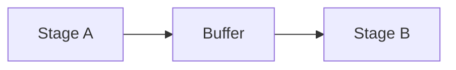

# Buffers

## Index

- [Summary](#summary)
- [Objective](#objective)
- [Scope](#scope)
- [Diagram](#diagram)
- [Responsibilities](#responsibilities)
- [Non-Responsibilities](#non-responsibilities)
- [Notes](#notes)
- [References](#references)
- [Acceptance Criteria](#acceptance-criteria)

## Summary

Buffers absorb timing variation between audio stages.

## Objective

Define buffer expectations in a simple, implementation-neutral way.

## Scope

This document covers buffering behavior and its role in timing stability.

## Diagram

## Responsibilities

- Smooth timing differences.
- Support predictable playback and processing.
- Help manage jitter and latency tradeoffs.

## Non-Responsibilities

- Define specific buffer algorithms.
- Hide performance costs.
- Replace latency budgeting.

## Notes

Buffers should be sized by explicit policy rather than guesswork.

## References

- [voice-pipeline.md](voice-pipeline.md)
- [latency-targets.md](latency-targets.md)
- [../04-network/jitter.md](../04-network/jitter.md)

## Acceptance Criteria

- Buffer behavior is described clearly.
- The buffer role in quality is explicit.
- No implementation details are required to understand it.
