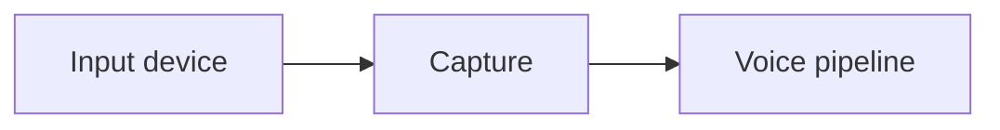

# Capture

## Index

- [Summary](#summary)
- [Objective](#objective)
- [Scope](#scope)
- [Diagram](#diagram)
- [Responsibilities](#responsibilities)
- [Non-Responsibilities](#non-responsibilities)
- [Notes](#notes)
- [References](#references)
- [Acceptance Criteria](#acceptance-criteria)

## Summary

Capture defines how input audio is obtained from a device for use by the system.

## Objective

Specify expected capture behavior without selecting a device API or implementation model.

## Scope

This document covers capture semantics only.

## Diagram

## Responsibilities

- Describe how audio enters the system.
- Support device selection and continuity expectations.
- Keep capture behavior portable.

## Non-Responsibilities

- Define device drivers.
- Define codec internals.
- Force a specific platform model.

## Notes

Capture should fail gracefully when hardware is unavailable.

## References

- [voice-pipeline.md](voice-pipeline.md)
- [device-management.md](device-management.md)
- [../11-performance/targets.md](../11-performance/targets.md)

## Acceptance Criteria

- Capture behavior is explicit.
- Device independence is preserved.
- The document stays implementation-neutral.
