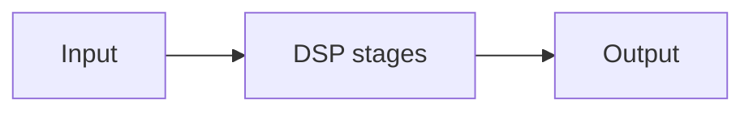

# DSP Pipeline

## Index

- [Summary](#summary)
- [Objective](#objective)
- [Scope](#scope)
- [Diagram](#diagram)
- [Responsibilities](#responsibilities)
- [Non-Responsibilities](#non-responsibilities)
- [Notes](#notes)
- [References](#references)
- [Acceptance Criteria](#acceptance-criteria)

## Summary

The DSP pipeline describes optional transformation stages applied to voice audio.

## Objective

Define the pipeline concept without specifying processing algorithms.

## Scope

This document covers processing stages only.

## Diagram

## Responsibilities

- Provide a place for optional audio processing.
- Keep processing stages separated from transport.
- Support quality and policy decisions.

## Non-Responsibilities

- Define concrete DSP algorithms.
- Mandate processing for all use cases.
- Replace pipeline or codec specifications.

## Notes

DSP should be optional and driven by documented requirements.

## References

- [voice-pipeline.md](voice-pipeline.md)
- [latency-targets.md](latency-targets.md)
- [../11-performance/targets.md](../11-performance/targets.md)

## Acceptance Criteria

- DSP is optional.
- The stage boundaries are clear.
- The document avoids algorithm detail.
