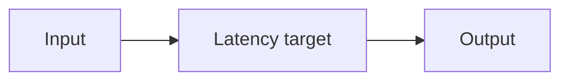

# Latency Targets

## Index

- [Summary](#summary)
- [Objective](#objective)
- [Scope](#scope)
- [Diagram](#diagram)
- [Responsibilities](#responsibilities)
- [Non-Responsibilities](#non-responsibilities)
- [Notes](#notes)
- [References](#references)
- [Acceptance Criteria](#acceptance-criteria)

## Summary

Latency targets define the desired responsiveness of the audio path.

## Objective

Give the audio system a concrete quality target without prescribing the implementation.

## Scope

This document covers target ranges and budget expectations.

## Diagram

## Responsibilities

- Set quality goals.
- Support performance planning.
- Provide a threshold for validation.

## Non-Responsibilities

- Guarantee impossible timing in all environments.
- Define transport rules.
- Replace actual measurement.

## Notes

Targets should be realistic across platforms and network conditions.

## References

- [buffers.md](buffers.md)
- [../11-performance/targets.md](../11-performance/targets.md)
- [../04-network/latency.md](../04-network/latency.md)

## Acceptance Criteria

- Latency targets are measurable.
- The targets match the product goals.
- The document does not overpromise quality.
