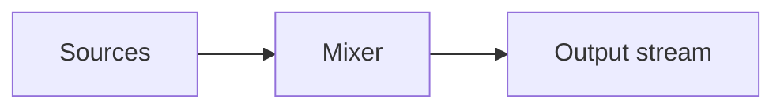

# Mixing

## Index

- [Summary](#summary)
- [Objective](#objective)
- [Scope](#scope)
- [Diagram](#diagram)
- [Responsibilities](#responsibilities)
- [Non-Responsibilities](#non-responsibilities)
- [Notes](#notes)
- [References](#references)
- [Acceptance Criteria](#acceptance-criteria)

## Summary

Mixing defines how multiple audio sources are combined into an output stream.

## Objective

Describe the expected mixing behavior at a high level.

## Scope

This document covers logical mixing behavior, not signal processing implementation.

## Diagram

## Responsibilities

- Combine sources predictably.
- Preserve priority and attenuation rules.
- Work with performance budgets.

## Non-Responsibilities

- Specify DSP implementation.
- Define platform mixer internals.
- Hide source priority rules.

## Notes

Mixing should stay conceptually simple enough for SDK authors to map cleanly.

## References

- [voice-pipeline.md](voice-pipeline.md)
- [../06-spatial/priority.md](../06-spatial/priority.md)
- [../11-performance/targets.md](../11-performance/targets.md)

## Acceptance Criteria

- Source combination rules are clear.
- Priority behavior is defined.
- The document does not depend on a specific audio engine.
