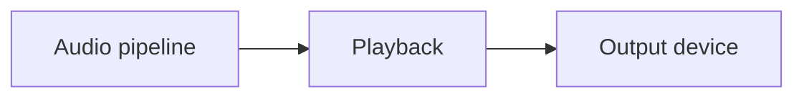

# Playback

## Index

- [Summary](#summary)
- [Objective](#objective)
- [Scope](#scope)
- [Diagram](#diagram)
- [Responsibilities](#responsibilities)
- [Non-Responsibilities](#non-responsibilities)
- [Notes](#notes)
- [References](#references)
- [Acceptance Criteria](#acceptance-criteria)

## Summary

Playback defines how rendered audio is delivered to an output device.

## Objective

Specify playback behavior without binding to a platform-specific audio engine.

## Scope

This document covers output behavior only.

## Diagram

## Responsibilities

- Deliver audible output predictably.
- Support latency and device availability expectations.
- Keep playback behavior portable.

## Non-Responsibilities

- Define low-level rendering implementation.
- Merge playback with core logic.
- Choose hardware-specific defaults.

## Notes

Playback should preserve clarity and timing within the stated budgets.

## References

- [voice-pipeline.md](voice-pipeline.md)
- [buffers.md](buffers.md)
- [../11-performance/targets.md](../11-performance/targets.md)

## Acceptance Criteria

- Playback is defined independently from capture.
- The document describes observable behavior.
- The model remains compatible with adapters.
