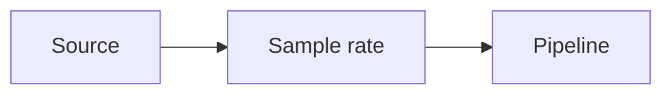

# Sample Rates

## Index

- [Summary](#summary)
- [Objective](#objective)
- [Scope](#scope)
- [Diagram](#diagram)
- [Responsibilities](#responsibilities)
- [Non-Responsibilities](#non-responsibilities)
- [Notes](#notes)
- [References](#references)
- [Acceptance Criteria](#acceptance-criteria)

## Summary

Sample rate policy defines the expected audio sampling behavior for the project.

## Objective

Specify sample rate expectations without constraining implementation more than necessary.

## Scope

This document covers rate selection and compatibility behavior.

## Diagram

## Responsibilities

- Define supported rate expectations.
- Keep compatibility clear.
- Support quality and performance planning.

## Non-Responsibilities

- Mandate one rate everywhere.
- Specify resampling algorithms.
- Hide tradeoffs from maintainers.

## Notes

Rate policy should be driven by interoperability and quality goals.

## References

- [buffers.md](buffers.md)
- [latency-targets.md](latency-targets.md)
- [../11-performance/targets.md](../11-performance/targets.md)

## Acceptance Criteria

- Sample-rate expectations are explicit.
- The document is compatible with future codecs.
- The rules remain engine-independent.
