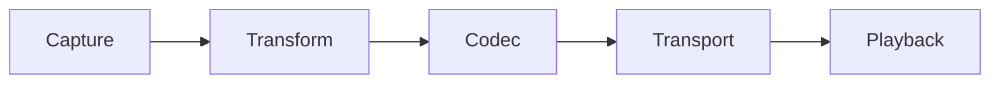

# Voice Pipeline

## Index

- [Summary](#summary)
- [Objective](#objective)
- [Scope](#scope)
- [Diagram](#diagram)
- [Responsibilities](#responsibilities)
- [Non-Responsibilities](#non-responsibilities)
- [Notes](#notes)
- [References](#references)
- [Acceptance Criteria](#acceptance-criteria)

## Summary

The voice pipeline describes the high-level flow from capture to playback.

## Objective

Define the functional stages that must exist in a voice system without fixing implementation details.

## Scope

This document covers the conceptual pipeline only.

## Diagram

## Responsibilities

- Explain the end-to-end flow.
- Separate stages so they can evolve independently.
- Support performance and quality planning.

## Non-Responsibilities

- Define specific filters or codecs.
- Specify network bytes.
- Hide stage boundaries.

## Notes

The pipeline should remain simple enough that each stage can be reasoned about independently.

## References

- [capture.md](capture.md)
- [playback.md](playback.md)
- [buffers.md](buffers.md)

## Acceptance Criteria

- The pipeline stages are clear.
- The flow is understandable without code.
- The document does not collapse separate concerns together.
