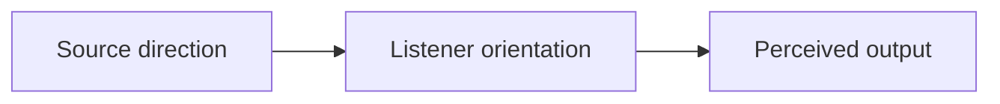

# Directional Audio

## Index

- [Summary](#summary)
- [Objective](#objective)
- [Scope](#scope)
- [Diagram](#diagram)
- [Responsibilities](#responsibilities)
- [Non-Responsibilities](#non-responsibilities)
- [Notes](#notes)
- [References](#references)
- [Acceptance Criteria](#acceptance-criteria)

## Summary

Directional audio describes how orientation influences perceived source placement.

## Objective

Specify directional behavior without selecting a rendering engine.

## Scope

This document covers directional perception rules only.

## Diagram

## Responsibilities

- Describe directional impact.
- Support spatial clarity.
- Integrate with distance and occlusion rules.

## Non-Responsibilities

- Define 3D rendering implementation.
- Force one coordinate system.
- Replace localization logic.

## Notes

Directional behavior should remain understandable for SDK authors and designers alike.

## References

- [distance-models.md](distance-models.md)
- [voice-falloff.md](voice-falloff.md)
- [../05-audio/mixing.md](../05-audio/mixing.md)

## Acceptance Criteria

- Directional influence is documented.
- The behavior is portable.
- The document avoids engine-specific implementation detail.
