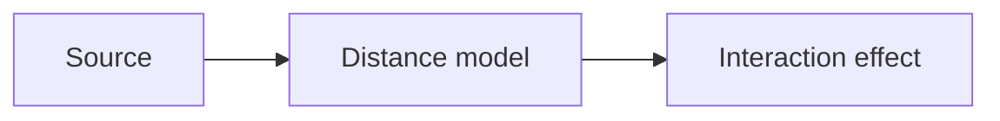

# Distance Models

## Index

- [Summary](#summary)
- [Objective](#objective)
- [Scope](#scope)
- [Diagram](#diagram)
- [Responsibilities](#responsibilities)
- [Non-Responsibilities](#non-responsibilities)
- [Notes](#notes)
- [References](#references)
- [Acceptance Criteria](#acceptance-criteria)

## Summary

Distance models define how spatial separation influences interaction behavior.

## Objective

Specify the role of distance as a policy input.

## Scope

This document covers conceptual distance handling only.

## Diagram

## Responsibilities

- Define how distance influences perception or delivery.
- Support multiple spatial interpretation styles.
- Stay consistent across SDKs and servers.

## Non-Responsibilities

- Choose one mathematical formula.
- Encode engine coordinates directly.
- Replace visibility or occlusion rules.

## Notes

Distance models should stay simple until a concrete need exists for more sophistication.

## References

- [voice-falloff.md](voice-falloff.md)
- [rooms.md](rooms.md)
- [../11-performance/targets.md](../11-performance/targets.md)

## Acceptance Criteria

- Distance influence is defined.
- The model is portable.
- The document remains implementation-neutral.
