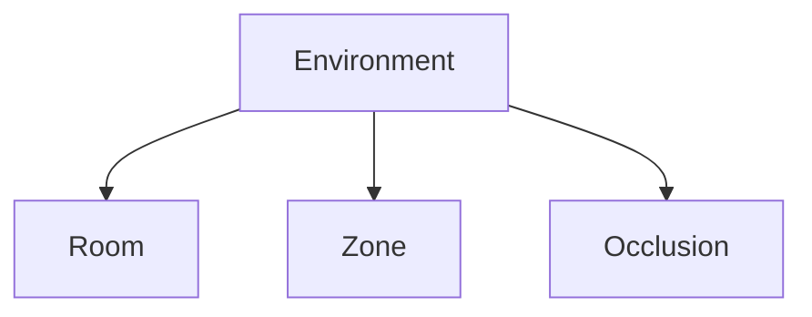

# Environment

## Index

- [Summary](#summary)
- [Objective](#objective)
- [Scope](#scope)
- [Diagram](#diagram)
- [Responsibilities](#responsibilities)
- [Non-Responsibilities](#non-responsibilities)
- [Notes](#notes)
- [References](#references)
- [Acceptance Criteria](#acceptance-criteria)

## Summary

Environment describes the spatial context that influences how voice and interaction behave.

## Objective

Define the role of environment in the spatial model.

## Scope

This document covers environmental influence at the contract level.

## Diagram

## Responsibilities

- Provide context for spatial rules.
- Connect rooms, zones, and occlusion.
- Remain simple and explicit.

## Non-Responsibilities

- Define scene graph internals.
- Replace the core domain model.
- Hard-code engine-specific environment data.

## Notes

Environment should support both simple and more detailed spatial setups.

## References

- [rooms.md](rooms.md)
- [zones.md](zones.md)
- [occlusion.md](occlusion.md)

## Acceptance Criteria

- Environment influence is clear.
- The document does not depend on one engine model.
- The scope stays manageable.
