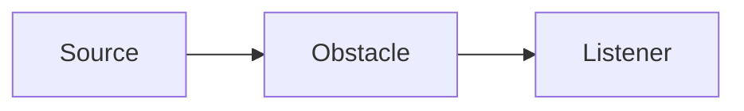

# Occlusion

## Index

- [Summary](#summary)
- [Objective](#objective)
- [Scope](#scope)
- [Diagram](#diagram)
- [Responsibilities](#responsibilities)
- [Non-Responsibilities](#non-responsibilities)
- [Notes](#notes)
- [References](#references)
- [Acceptance Criteria](#acceptance-criteria)

## Summary

Occlusion describes how obstacles affect spatial interaction and perceived audio.

## Objective

Define occlusion behavior without prescribing the detection method.

## Scope

This document covers expected results, not raycasting or physics details.

## Diagram

## Responsibilities

- Describe obstacle-driven effect changes.
- Support realistic spatial behavior.
- Remain portable across runtimes.

## Non-Responsibilities

- Define physics or visibility algorithms.
- Mandate one scene representation.
- Replace distance or room logic.

## Notes

Occlusion should be a policy layer, not a hidden side effect.

## References

- [environment.md](environment.md)
- [directional-audio.md](directional-audio.md)
- [../07-server/state.md](../07-server/state.md)

## Acceptance Criteria

- Occlusion behavior is defined.
- The effect is understandable without implementation.
- The document stays engine-agnostic.
