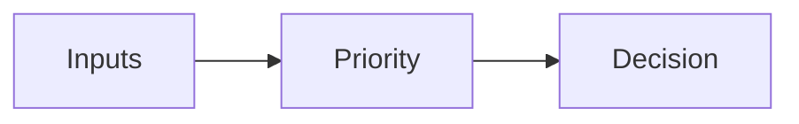

# Priority

## Index

- [Summary](#summary)
- [Objective](#objective)
- [Scope](#scope)
- [Diagram](#diagram)
- [Responsibilities](#responsibilities)
- [Non-Responsibilities](#non-responsibilities)
- [Notes](#notes)
- [References](#references)
- [Acceptance Criteria](#acceptance-criteria)

## Summary

Priority determines which spatial interactions should take precedence when resources are limited.

## Objective

Define priority as a policy concept.

## Scope

This document covers priority rules, not scheduling algorithms.

## Diagram

## Responsibilities

- Resolve conflicts predictably.
- Support server and client policies.
- Keep interaction ordering understandable.

## Non-Responsibilities

- Hide low-priority behavior.
- Define scheduling internals.
- Replace explicit policy decisions.

## Notes

Priority should be used sparingly and only when it adds clarity.

## References

- [voice-modes.md](voice-modes.md)
- [rooms.md](rooms.md)
- [../05-audio/mixing.md](../05-audio/mixing.md)

## Acceptance Criteria

- Priority behavior is explicit.
- The policy is easy to review.
- The document avoids unnecessary complexity.
