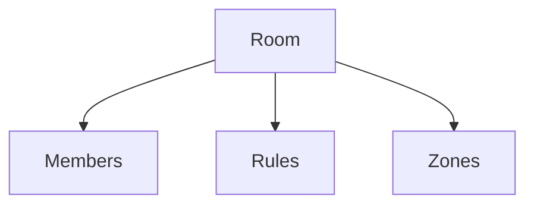

# Rooms

## Index

- [Summary](#summary)
- [Objective](#objective)
- [Scope](#scope)
- [Diagram](#diagram)
- [Responsibilities](#responsibilities)
- [Non-Responsibilities](#non-responsibilities)
- [Notes](#notes)
- [References](#references)
- [Acceptance Criteria](#acceptance-criteria)

## Summary

Rooms are logical spatial containers that group participants and rules.

## Objective

Describe room behavior in a simple and portable way.

## Scope

This document covers logical room semantics.

## Diagram

## Responsibilities

- Group participants and interaction policies.
- Support room-level state.
- Remain simple for server and SDK layers.

## Non-Responsibilities

- Define physical world simulation.
- Replace channels or sessions.
- Overload rooms with unrelated concerns.

## Notes

Rooms should be a clear, useful abstraction rather than a catch-all container.

## References

- [zones.md](zones.md)
- [spatial-events.md](spatial-events.md)
- [../07-server/rooms.md](../07-server/rooms.md)

## Acceptance Criteria

- Room meaning is clear.
- The abstraction stays narrow.
- The document fits the overall architecture.
