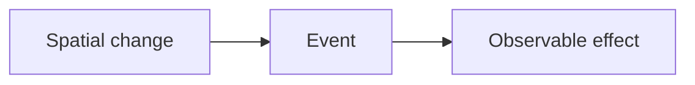

# Spatial Events

## Index

- [Summary](#summary)
- [Objective](#objective)
- [Scope](#scope)
- [Diagram](#diagram)
- [Responsibilities](#responsibilities)
- [Non-Responsibilities](#non-responsibilities)
- [Notes](#notes)
- [References](#references)
- [Acceptance Criteria](#acceptance-criteria)

## Summary

Spatial events are changes in spatial state that produce observable effects.

## Objective

Specify event behavior at the contract level.

## Scope

This document covers spatial event semantics, not transport or runtime dispatch.

## Diagram

## Responsibilities

- Describe when spatial changes matter.
- Support event-driven integrations.
- Stay aligned with rooms, zones, and priority rules.

## Non-Responsibilities

- Define dispatch queues.
- Replace network events or protocol messages.
- Add extra event categories without need.

## Notes

Events should be few, meaningful, and stable.

## References

- [rooms.md](rooms.md)
- [zones.md](zones.md)
- [../10-protocol/messages.md](../10-protocol/messages.md)

## Acceptance Criteria

- Event meaning is explicit.
- The document is small and readable.
- The behavior is implementation-neutral.
