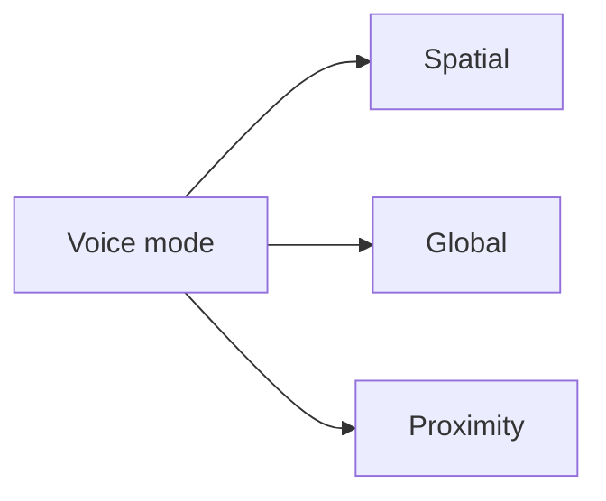

# Voice Modes

## Index

- [Summary](#summary)
- [Objective](#objective)
- [Scope](#scope)
- [Diagram](#diagram)
- [Responsibilities](#responsibilities)
- [Non-Responsibilities](#non-responsibilities)
- [Notes](#notes)
- [References](#references)
- [Acceptance Criteria](#acceptance-criteria)

## Summary

Voice modes define the behavioral style of voice delivery in a spatial context.

## Objective

Describe common voice interaction modes without constraining implementation.

## Scope

This document covers mode semantics, not user-interface or device handling.

## Diagram

## Responsibilities

- Distinguish how voice should behave in different scenarios.
- Keep mode definitions understandable.
- Support server and SDK policy.

## Non-Responsibilities

- Implement UI toggles.
- Define audio processing algorithms.
- Expand modes unnecessarily.

## Notes

Modes should be few, clear, and stable.

## References

- [priority.md](priority.md)
- [rooms.md](rooms.md)
- [../07-server/channels.md](../07-server/channels.md)

## Acceptance Criteria

- Modes are explicit and limited.
- The document stays KISS-friendly.
- The behavior is consistent across integrations.
