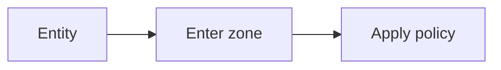

# Zones

## Index

- [Summary](#summary)
- [Objective](#objective)
- [Scope](#scope)
- [Diagram](#diagram)
- [Responsibilities](#responsibilities)
- [Non-Responsibilities](#non-responsibilities)
- [Notes](#notes)
- [References](#references)
- [Acceptance Criteria](#acceptance-criteria)

## Summary

Zones are spatial areas that influence interaction behavior when entities enter or leave them.

## Objective

Define zone semantics without choosing a geometry engine.

## Scope

This document covers zone behavior and policy triggers.

## Diagram

## Responsibilities

- Trigger spatial rules based on location.
- Support room and environment behavior.
- Keep zone meaning explicit.

## Non-Responsibilities

- Define collision or physics internals.
- Replace rooms or channels.
- Encode engine-specific geometry details.

## Notes

Zones should be easy to reason about and cheap to explain.

## References

- [rooms.md](rooms.md)
- [spatial-events.md](spatial-events.md)
- [../04-network/interest-management.md](../04-network/interest-management.md)

## Acceptance Criteria

- Zone behavior is clear.
- The concept is portable.
- The document avoids engine coupling.
