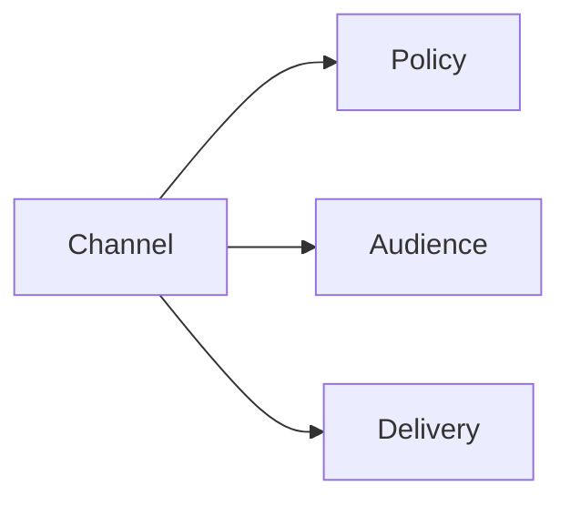

# Channels

## Index

- [Summary](#summary)
- [Objective](#objective)
- [Scope](#scope)
- [Diagram](#diagram)
- [Responsibilities](#responsibilities)
- [Non-Responsibilities](#non-responsibilities)
- [Notes](#notes)
- [References](#references)
- [Acceptance Criteria](#acceptance-criteria)

## Summary

Channels group communication paths with shared policy and audience rules.

## Objective

Define channel semantics as a server concern.

## Scope

This document covers logical channel behavior.

## Diagram

## Responsibilities

- Group communication by purpose.
- Support permissions and presence.
- Keep routing rules explicit.

## Non-Responsibilities

- Define packet layout.
- Become a transport tunnel abstraction.
- Hide channel meaning from the protocol.

## Notes

Channels should remain few and understandable.

## References

- [permissions.md](permissions.md)
- [presence.md](presence.md)
- [../10-protocol/messages.md](../10-protocol/messages.md)

## Acceptance Criteria

- Channel behavior is easy to describe.
- The abstraction stays narrow.
- The document supports future SDKs.
