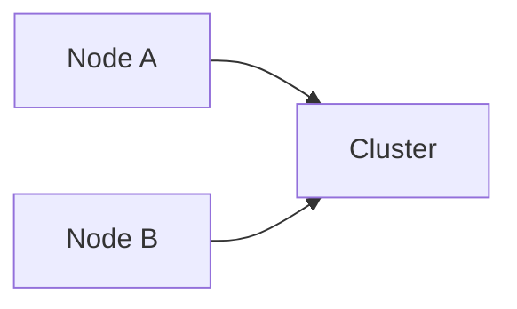

# Horizontal Scaling

## Index

- [Summary](#summary)
- [Objective](#objective)
- [Scope](#scope)
- [Diagram](#diagram)
- [Responsibilities](#responsibilities)
- [Non-Responsibilities](#non-responsibilities)
- [Notes](#notes)
- [References](#references)
- [Acceptance Criteria](#acceptance-criteria)

## Summary

Horizontal scaling describes the ability to support more load by adding capacity rather than only growing one node.

## Objective

Define horizontal scaling expectations without choosing a concrete architecture.

## Scope

This document covers scale-out behavior only.

## Diagram

## Responsibilities

- Support growth in capacity.
- Preserve contract behavior across nodes.
- Keep scaling model explicit.

## Non-Responsibilities

- Define load balancer internals.
- Mandate sharding or partition schemes.
- Replace persistence design.

## Notes

Scaling decisions should be made with the simplest viable model first.

## References

- [scalability.md](scalability.md)
- [persistence.md](persistence.md)
- [../14-build/build-matrix.md](../14-build/build-matrix.md)

## Acceptance Criteria

- Scale-out behavior is understandable.
- The model is implementation-neutral.
- The document supports future operations work.
