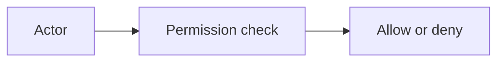

# Permissions

## Index

- [Summary](#summary)
- [Objective](#objective)
- [Scope](#scope)
- [Diagram](#diagram)
- [Responsibilities](#responsibilities)
- [Non-Responsibilities](#non-responsibilities)
- [Notes](#notes)
- [References](#references)
- [Acceptance Criteria](#acceptance-criteria)

## Summary

Permissions control which actions or data a participant may access.

## Objective

Define authorization behavior in a simple and explicit way.

## Scope

This document covers authorization semantics only.

## Diagram

## Responsibilities

- Separate authorization from authentication.
- Support room and channel policy.
- Keep access control understandable.

## Non-Responsibilities

- Define identity verification.
- Encode provider-specific models.
- Overcomplicate policy syntax.

## Notes

Permissions should be easy to audit and reason about.

## References

- [authentication.md](authentication.md)
- [channels.md](channels.md)
- [../12-security/security-model.md](../12-security/security-model.md)

## Acceptance Criteria

- Authorization behavior is explicit.
- The model is not mixed with authentication.
- The document remains concise.
