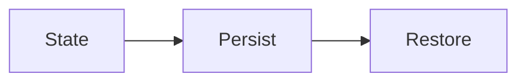

# Persistence

## Index

- [Summary](#summary)
- [Objective](#objective)
- [Scope](#scope)
- [Diagram](#diagram)
- [Responsibilities](#responsibilities)
- [Non-Responsibilities](#non-responsibilities)
- [Notes](#notes)
- [References](#references)
- [Acceptance Criteria](#acceptance-criteria)

## Summary

Persistence describes what server-side information can survive process or node changes.

## Objective

Specify persistence expectations without defining a storage system.

## Scope

This document covers persistence semantics only.

## Diagram

## Responsibilities

- Identify durable state requirements.
- Support recovery and continuity.
- Remain compatible with scalability needs.

## Non-Responsibilities

- Choose a database.
- Define schema layout.
- Force persistence for all state.

## Notes

Only state that benefits from durability should be persisted.

## References

- [state.md](state.md)
- [scalability.md](scalability.md)
- [../16-roadmap/technical-backlog.md](../16-roadmap/technical-backlog.md)

## Acceptance Criteria

- Persistent vs transient state is clear.
- The document does not dictate storage technology.
- The rules remain simple.
